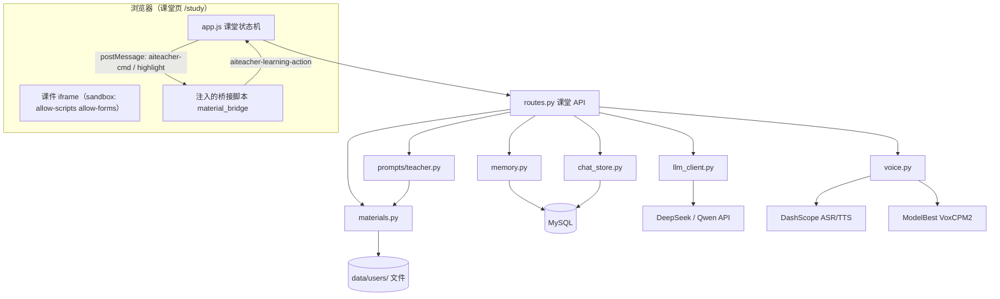
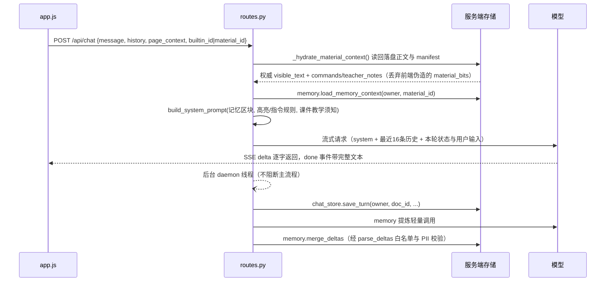

# 系统架构（architecture）

> 本文描述**当前代码的实际结构**。产品意图见 [product.md](product.md)，接口细节见 [api.md](api.md)，落盘与表结构见 [database.md](database.md)，决策原因见 [decisions/](decisions/README.md)。

## 1. 系统上下文

单仓库、单 Flask 应用、单体部署。`src/web_server.py` 创建 app 并注册两个 Blueprint：

- `/account` → `src/account`（通用账户模块）
- `/aiteacher` → `src/apps/aiteacher`（AI 课堂，核心业务）
- 应用级路由在 `src/web_server.py`：`GET /`（宣传页 `src/templates/home.html`）、`GET /study`（课堂，直接渲染 `src/apps/aiteacher/templates/aiteacher/index.html` 并注入 `DEMO_COURSE`）、`GET /health`、`GET /favicon.ico`。

仓库最初孵化自 GoodPage 多子应用框架，因此 `src/services/`、`src/utils/`、`src/i18n/`、`src/db_manager.py` 是框架遗留的通用能力；当前课堂业务只直接依赖 `src/llm_client.py`、`src/logger.py`、`config.config` 与 `src/i18n`（经 `src/account` 调用）。

参与者：浏览器中的学习者/照护者、AI Teacher 服务端、外部模型与语音服务、MySQL、Redis（可选）。

## 2. 仓库布局

```text
.
├── app.py                      # 开发启动入口，默认端口 5058
├── gunicorn.conf.py            # 生产 WSGI 配置
├── config/                     # config.py 可提交默认值；config_local.py 已 gitignore
├── data/users/<owner>/         # 学习材料落盘（用户数据，不入库）
├── docs/                       # 项目文档体系（本目录）
├── tasks/                      # 任务记录与 Agent 交接模板
└── src/
    ├── web_server.py           # Flask app、会话、CORS、安全头、蓝图注册
    ├── llm_client.py           # 统一 LLM 客户端（普通/流式/JSON）
    ├── logger.py               # 日志（logs/ 下按日期）
    ├── prompts/                # 提示词层（teacher.py / memory_extractor.py）
    ├── account/                # 账户模块（MySQL sys_user）
    ├── i18n/                   # 中英文案（只服务账户模块）
    ├── services/ · utils/ · db_manager.py   # 框架遗留通用能力
    └── apps/aiteacher/         # AI 课堂核心子应用
        ├── routes.py · course.py · materials.py · memory.py · chat_store.py
        ├── material_manifest.py · material_bridge.py · builtin_materials.py · voice.py
        ├── builtin_materials/*.html          # 内置课件本体
        ├── static/ · templates/aiteacher/    # 前端源码与课堂单页
        └── tests/                            # smoke.py + test_memory.py
```

## 3. 主要组件

| 组件 | 入口文件 | 职责 |
|---|---|---|
| 应用装配 | `src/web_server.py` | Flask app、Session（Redis 或 Cookie）、CORS（仅 `/api/*`）、安全响应头、错误处理、蓝图注册 |
| 本地入口 | `app.py` | 加载 `.env`，按 `HOST`/`PORT`（默认 5058）启动 |
| 课堂路由 | `src/apps/aiteacher/routes.py` | 页面、上下文组装、SSE 对话、材料接口、语音接口、主动等待判定、CSP 预览 |
| 默认课程内容 | `src/apps/aiteacher/course.py` | 仅 `DEMO_COURSE` 数据（课件加载失败时的降级展示），不含教学规则 |
| 提示词层 | `src/prompts/teacher.py`、`src/prompts/memory_extractor.py` | 系统提示词分层拼装、课件指令注册表 `MATERIAL_COMMANDS`、记忆提炼输出校验 |
| 材料服务 | `src/apps/aiteacher/materials.py` | 生成/抓取/上传/提取/落盘/读取、SSRF 校验、owner 目录归一 |
| 内置教程 | `src/apps/aiteacher/builtin_materials.py` + `builtin_materials/*.html` | 目录登记展示元数据；课件本体是自包含 HTML |
| 课件协议 | `src/apps/aiteacher/material_manifest.py`、`material_bridge.py` | 解析课件能力清单；向课件注入桥接脚本 |
| 记忆 | `src/apps/aiteacher/memory.py` | 三层记忆读写、惰性建表、按预算注入 |
| 聊天历史 | `src/apps/aiteacher/chat_store.py` | 会话与消息持久化、确定性会话号 |
| 语音 | `src/apps/aiteacher/voice.py` | ASR 转写、TTS 合成（VoxCPM2 优先、Qwen3-TTS 回落）、音色白名单 |
| 模型客户端 | `src/llm_client.py` | 统一封装 DeepSeek / Qwen 的普通、流式、JSON 调用 |
| 账户 | `src/account/`（`routes`/`auth_controller`/`models`） | 注册、登录、登出、资料、改密；复用 MySQL `sys_user` |
| 前端 | `src/apps/aiteacher/static/app.js`、`src/apps/aiteacher/static/app.css`、`src/apps/aiteacher/templates/aiteacher/index.html` | 课堂状态机、上下文上报、`localStorage` 持久化、流式渲染、指令剥离与派发、录音与播放 |
| 日志 | `src/logger.py` | `logs/<日期>.log` + 控制台 |

## 4. 组件关系



## 5. 一轮对话的数据流



前端从回复中剥离 `[[highlight:…]]`、`[[hint:…]]`、`[[reveal:…]]`、`[[step:…]]` 后再渲染，并通过 `postMessage` 派发给课件；完整协议见 [material-protocol.md](material-protocol.md)。

## 6. 外部依赖

| 依赖 | 用途 | 配置来源 |
|---|---|---|
| DeepSeek API | 对话与生成（`CURRENT_MODEL='deepseek'`） | `config/config.py`：`DEEPSEEK_API_KEY/URL/MODEL` |
| 阿里云百炼 Qwen（兼容模式） | 对话（`CURRENT_MODEL='qwen'`）、图片理解模型位 | `QWEN_API_KEY/BASE_URL/MODEL`、`QWEN_VL_MODEL` |
| DashScope | ASR `qwen3-asr-flash`、TTS `qwen3-tts-flash` | `DASHSCOPE_API_KEY`、`DASHSCOPE_BASE_URL`、`TTS_CONFIG` |
| ModelBest VoxCPM2 | 真人感 TTS（优先），失败时回落 Qwen | `VOXCPM_CONFIG` / `MODELBEST_API_KEY` |
| MySQL | 账户、聊天历史、三层记忆 | `DB_CONFIG` |
| Redis | Session 存储（不可用时自动回退签名 Cookie） | `REDIS_CONFIG` |
| 阿里云 OSS | 通用文件存储后端，**课堂业务未启用** | `STORAGE_CONFIG['backend']='disk'` |
| 浏览器 `speechSynthesis` | 前端语音兜底 | — |

`src/services/oss_storage.py` 属于框架保留能力；`src/apps/aiteacher/materials.py` 使用本地磁盘目录，不经过该层。

## 7. 数据与存储

| 数据 | 位置 | 建表方式 |
|---|---|---|
| 学习材料 | 文件 `data/users/<owner>/<id>.html` + `<id>.json` | 直接写文件（`AITEACHER_DATA_ROOT` 可改根目录） |
| 三层记忆 | MySQL `at_memory` | 首次使用时惰性 `CREATE TABLE IF NOT EXISTS` |
| 聊天会话/消息 | MySQL `ai_chat_sessions`、`ai_chat_messages` | **本项目不建表**，依赖外部已存在的同名表 |
| 账户 | MySQL `sys_user` | 由 GoodPage 框架既有表提供 |
| 会话状态 | Redis 或签名 Cookie | — |
| 学习偏好、课件进度 | 浏览器 `localStorage` | — |

细节见 [database.md](database.md)。

## 8. 认证与权限边界

- 服务端以 Flask session 判定登录：`session['is_logged_in']` + `session['username']`（`src/account/auth_controller.py`）。
- 材料归属由 `routes._current_material_owner()` 决定：登录用户 → `safe_owner_name(username)`；未登录 → 会话内首访生成 `aiteacher_guest_id`，目录为 `guest-<16位hex>`。读取材料时 `_current_material_owners()` 同时允许本次会话登录前的访客目录，登录后不丢文件。
- **`/aiteacher/api/*` 与 `/account/api/*` 均无路由级强制登录装饰器**：接口依赖 session 推导 owner，而非要求登录。`auth_controller.require_login` 存在但未被课堂接口使用。
- 口令散列为 MD5（`src/account/models.py::hash_password`），与框架既有表兼容；改进属于已知技术债。
- CORS 只对 `/api/*` 放开 `origins: "*"`（`src/web_server.py`），而 `/aiteacher/api/*` 不在该前缀下，属同源。

## 9. 部署拓扑（摘要）

单机、双 gunicorn 实例（gevent worker）：HTTPS 端口承载语音功能，HTTP 端口用于快速自测。细节、发布流程与限制见 [deployment.md](deployment.md)。

## 10. 关键技术约束

1. **降级优先于报错**：记忆、历史、Redis、语音、主动判定任一失败都不得影响对话返回；异常只写日志（`memory.py`、`chat_store.save_turn`、`routes._schedule_background_work`、`_nudge_wait`）。
2. **服务端才是材料的权威**：前端只上报编号，正文与能力清单由服务端读盘派生（`_hydrate_material_context`）。
3. **提示词集中在 `src/prompts/`**，公共层不得写入任何具体课件的学科内容；课件个性规则由课件自己的 manifest 携带。
4. **无异步任务基础设施**：后台工作使用进程内 daemon 线程（`gunicorn.conf.py` 3 个 worker，无共享队列），因此进程被回收时未完成的记忆提炼会丢失。
5. **课件沙箱**：预览响应带严格 CSP（`sandbox allow-scripts; default-src 'none'; …`），iframe 无 `allow-same-origin`，课件内不可用 `localStorage`。
6. **对话语言固定为中文**：`LLMClient(language='zh')` 硬编码，`src/i18n/` 只服务账户模块文案。
7. **依赖版本受服务器环境约束**：`urllib3<2`（服务器 OpenSSL 1.0.2）、`gevent==23.9.1`（cp39 预编译 wheel），升级需先在服务器验证。
8. **`.gitignore` 为白名单式**（先 `/*` 再 `!` 放行）：新增根目录文件必须显式放行，否则不会进入版本控制。

## 11. 已知技术债

| 项 | 位置 | 影响 |
|---|---|---|
| 口令使用 MD5 | `src/account/models.py::hash_password` | 弱散列；换 bcrypt/argon2 需处理既有数据兼容 |
| 无数据库迁移工具 | 全仓库 | `ai_chat_*` 依赖外部表，新环境部署会静默丢失历史功能 |
| 进程内线程做后台工作 | `routes._schedule_background_work` | 无重试、无水平扩展；重启丢任务 |
| 文件存储而非数据库存材料 | `materials.py` | 多实例部署需要共享磁盘，`data/users/` 不随代码走 |
| 记忆提炼每轮额外一次模型调用 | `memory.extract_and_store` | 成本随对话轮次线性增长（已用短消息跳过缓解） |
| 模型指令遵从率约 50% | [material-protocol.md](material-protocol.md) 第 9 节 | 交互不能只押在模型发指令上 |
| 框架遗留模块未被使用 | `src/services/`、`src/utils/text_cleaner.py`、`src/db_manager.py`、`src/routes/` | 增加阅读噪声；删除前需确认无外部调用 |
| 访客记忆不跨设备 | Cookie/Redis session | 需要 owner 合并逻辑才能迁移 |

待确认：`config/config-server.py`（当前已暂存进索引但无任何代码 import 它）与 `config/config_local.py` 的分工，以及仓库是否需要保留 GoodPage 框架的通用服务层。
