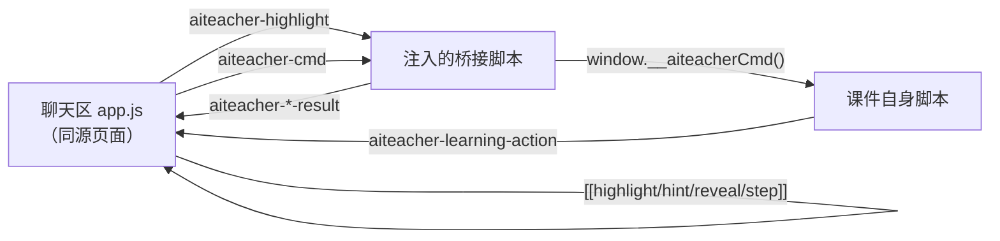

# 课件交互协议（标准开发文档）

版本：schema 1 ｜ 适用：`src/apps/aiteacher` 课堂页与右侧课件 ｜ 更新日期：2026-09-24

本文是聊天区与课件之间唯一的接口规范。新增课件、新增指令、修改桥接脚本都以本文为准；
代码与本文冲突时，视为缺陷。

---

## 1. 三条设计原则

1. **公共层不理解任何具体课件。** `app.js`、`material_bridge.py`、`teacher.py`、`routes.py` 里
   不得出现某个课件的学科名、课文内容、关卡数量或教学法。课件的知识全部由课件自己声明。
2. **每个课件是一个自包含的 HTML 文件。** 零依赖、零构建、样式与逻辑自带；删掉这个文件，
   公共架构一行都不用改。
3. **契约显式化。** 课件对外提供哪些操作、需要老师怎么对待本课，写进课件内的 manifest；
   聊天区对课件提供哪些服务，写进本文第 5、6 节。不靠猜。

---

## 2. 运行边界



- 课件在 `<iframe id="materialFrame" sandbox="allow-scripts allow-forms">` 内运行，
  **没有 `allow-same-origin`**，即 opaque origin。由此产生三条硬约束：
  - 不能使用 `localStorage` / `indexedDB`，学习进度只能存内存（刷新即重来）；
  - 不能访问父页面 DOM，也不能读写本站 Cookie；
  - `postMessage` 双向可用，这是唯一通道。
- 桥接脚本由 `material_bridge.inject_bridge()` 在 viewer 响应时注入到最后一个 `</body>` 前。
  因此**历史课件无需重新生成即可自动获得公共层新增的能力**（高亮、指令转发）。
- 双向都用 `event.source` 校验消息来源，不校验 `origin`（opaque origin 下 `origin` 恒为 `"null"`）。

---

## 3. 课件清单 manifest

课件在 `</body>` 前放一个 JSON 脚本块声明自己的能力：

```html
<script type="application/aiteacher+json" id="aiteacher-manifest">
{
  "schema": 1,
  "commands": ["hint", "reveal", "step"],
  "teacher_notes": "本课练的是一格一词敲英文。大小写与句末标点不算错，不要为此纠正；孩子漏掉句首动词时先给半句示范，不要直接讲语法术语。",
  "command_guide": {
    "hint": "本课：在练习区包含该词的空格上亮出首字母，形如 h······",
    "step": "本课共 4 关，step 填 1—4"
  }
}
</script>
```

| 字段 | 类型 | 必填 | 上限 | 语义 |
| --- | --- | --- | --- | --- |
| `schema` | int | 是 | - | 当前为 `1`。缺失或不等于 1 时整份清单作废 |
| `commands` | string[] | 否 | 8 项 | 课件实现了哪些指令；未在服务端注册表里的名字最终会被丢弃（第 6.2 节） |
| `teacher_notes` | string | 否 | 2000 字 | 本课的教学须知，原样拼进 system prompt |
| `command_guide` | map | 否 | 每条 200 字 | 覆盖注册表里对应指令的说明文字，用于把通用描述写成本课的具体表现 |

解析与收敛分两层做：

- `material_manifest.parse_manifest()` 只做**结构与长度**校验：JSON 语法错误、结构不对、`schema` 不认识
  → 返回空清单，**绝不抛异常**，课件照常可用；未识别的字段一律忽略，便于向前兼容；
  `command_guide` 里未在 `commands` 中声明的键被丢弃。
- `routes._trusted_bits()` 再做**策略**收敛：用注册表过滤未知指令名、限制各字段长度。
  模型提示词与下发给前端的 `commands` 都出自这里，所以未注册的名字既不会进提示词也不会到前端。

### 3.1 信任分级（安全红线）

`teacher_notes` 与 `command_guide` 会进入 system prompt，属于**指令文本**，因此只采纳可信来源：

| `source_type` | 采纳 `commands` | 采纳 `teacher_notes` / `command_guide` |
| --- | --- | --- |
| `builtin`（仓库内置教程） | 是 | 是 |
| `generated`（本系统 AI 生成） | 是 | 是 |
| `uploaded` / `url`（第三方网页、上传文件） | 是 | **否**，只当它是数据 |

`material_bits` 由服务端从落盘文件解析后注入，`_hydrate_material_context()` 会先 `pop` 掉前端
可能伪造的同名字段。**聊天区前端上报的 `page_context` 任何字段都不构成指令。**

### 3.2 不污染正文

`materials.extract_html_text()` 会 `decompose` 掉 `script` 标签，因此 manifest 不会进入
AI 看到的「屏幕教学文字」；同理，`data-answer` 之类的属性也不会被提取——判分与讲解所需的内容
必须写成**页面上可见的文本**，不能只藏在属性里。

### 3.3 能力清单会下发给前端

`/api/builtin-materials/<id>` 与 `/api/materials/<id>` 的响应里带 `commands` 数组，`app.js` 据此
门禁：课件没声明的指令不再往 iframe 投递，直接提示用户。两条约定：

- 该字段是**派生数据**，列表类接口（摘要）不携带；字段缺失时前端照常投递，由课件的 `handled` 回执兜底；
- 前端只上报**编号**（`builtin_id` / `material_id` / `course_id`），从不上报清单文本，
  避免把可篡改的内容送进提示词。

### 3.4 没有课件 iframe 的时候

`/study` 默认课程右侧不是 iframe，没有课件文件可解。此时前端上报 `course_id`，
服务端按该编号找到同名内置教程、读它的 manifest，才能照常拿到本课教学须知（但不会
advertise 高亮与操作指令，因为确实没有可操作的课件）。新增默认课程时，只要 `DEMO_COURSE['id']`
与内置教程编号一致，就不需要改任何公共代码。

---

## 4. 课件 → 聊天区：`aiteacher-learning-action`

```js
function notify(action, spoken = '', respond = false) {
  parent.postMessage({ type: 'aiteacher-learning-action', action, spoken, respond }, '*');
}
```

| 字段 | 作用 | 约束 |
| --- | --- | --- |
| `action` | 写进聊天区 `state.lastAction`，随下一轮请求以「孩子刚才的操作」上报给模型 | ≤300 字，写人话，不写字段名 |
| `spoken` | 让老师朗读这句话 | ≤300 字；为空表示没有要朗读的话 |
| `respond` | 召唤 AI 主动回话 | 消息文本取 `spoken \|\| action` |

**`spoken` 与 `respond` 互不依赖**（此语义由本轮重构固定，此前 `respond` 被错误地嵌在
`if (spoken)` 里，导致空 `spoken` 的事件永远召唤不了老师）：

- 只想记上下文：`notify('第2关第3空填对：your')`
- 只想朗读：`notify('点击了听老师读', 'Is this your handbag?')`
- 要老师介入：`notify('第2关第1空连错2次，孩子输入的是"is"，标准答案 Is', '', true)`
- 朗读且介入：`notify('完成第1关，拼出 Excuse me!', 'Excuse me!', true)`

事件分级要求：**高频小事件一律 `respond:false`**（每空填对、切关、点提示按钮的页面动作），
只有需要老师决定的节点才 `respond:true`（连错到阈值、主动求助、本关完成、整课完成）。
否则每敲一个词就召唤一次模型，既烧额度又打断孩子。

朗读限制：`spoken` 走 Web Audio，**必须有用户手势**才播得出来。首次加载课件时不要带
`spoken` 上报，否则被浏览器静默拦截。

---

## 5. 聊天区 → 课件：高亮（公共能力，无需声明）

模型回复中插入 `[[highlight:课件原文短语]]`，前端剥离后发 `{type:'aiteacher-highlight', query}`，
由桥接脚本用 TreeWalker 匹配文本节点、`<mark>` 包裹，黄底闪烁 6 秒并滚动居中，回执
`aiteacher-highlight-result{query,count}`；`count=0` 时聊天区提示"课件里没找到"。

- `value` 必须逐字来自页面可见文本，≤100 字；被标签拆开的词匹配不到，属已知限制；
- 所有课件免费获得该能力，课件**不要**自己实现高亮。

---

## 6. 聊天区 → 课件：操作指令（需课件声明）

### 6.1 链路

前端从回复中剥离 `[[type:value]]` → 发 `{type:'aiteacher-cmd', action, value}` → 桥接脚本
调用课件实现的钩子 → 回执 `{type:'aiteacher-cmd-result', action, value, handled}`。

桥接层**只做传输与兜底**，不实现任何业务表现；`handled:false` 时聊天区提示"这个课件还不能
这样操作，老师直接用文字讲给你听"，避免指令静默失败。

### 6.2 指令注册表（服务端唯一事实源：`teacher.py.MATERIAL_COMMANDS`）

| 名字 | 通用语义 | 由课件决定具体表现 |
| --- | --- | --- |
| `hint` | 给孩子一个提示 | 亮首字母 / 高亮词根 / 展开选项，任意 |
| `reveal` | 公布目标的答案 | 填进空格 / 显示解析 |
| `step` | 跳转到课件的指定环节 | 翻页 / 滚动到锚点 |

新增指令必须同时改三处：注册表加条目 → 课件实现钩子 → 本文加一行。**只在一处改会导致
模型收不到该语法（被注册表白名单丢弃）或发出来没人执行。**

### 6.3 课件侧实现约定

```js
window.__aiteacherCmd = function ({ action, value }) {
  if (action === 'hint') { showHint(findBlank(value)); return true; }
  return false;                    // 不认识 / 找不到目标，必须返回 false
};
```

- **同步返回 `true`/`false`**，不能返回 Promise；返回其他真值按未处理对待；
- **必须幂等**：同一条指令重复到达不得累积副作用（模型有时会在一条回复里发两次）；
- **不得抛异常**：桥接层会 `catch` 成 `handled:false`，但异常会丢掉本该有的页面反馈；
- 找不到目标时返回 `false` 而不是"近似执行"；
- 若目标属于其他环节，允许跳转过去，但要在 UI 上看得出发生了什么。

### 6.4 模型侧规则

规则文本由 `build_material_command_rules(commands)` 依据注册表（及 builtin 的
`command_guide` 覆盖）**动态生成**：

- 课件没声明的指令**不会出现在 prompt 里**，防止模型输出课件执行不了的语法；
- 每条回复合计最多 2 个指令；
- 明确"说到就要做到"：没插入指令就不许对孩子承诺"已经给你亮上了"。

实测遵从率约 50%（6 次里 3 次真发指令）。因此**凡是能本地确定性做到的事，不要依赖模型**：
例如「要提示」按钮应当由课件自己立刻产生提示，同时再上报事件请老师讲解。

### 6.5 前端剥离与流式

`extractHighlightDirectives()` 返回 `{text, queries, commands}`：

- 四类指令都被剥掉，学员永远看不到 `[[...]]`；全角冒号与大小写都接受；
- 流式回复逐字到达，对"还可能长成已知指令"的未闭合前缀（如 `[[h`、`[[hint:ha`）**先暂扣**，
  等闭合后再派发；不像指令的 `[[`（如 `[[引用]]`）照常显示；
- 派发用游标推进，只发新增部分，避免重复高亮。

---

## 7. 新增一个交互课件

1. 在 `src/apps/aiteacher/builtin_materials/` 放一个自包含 HTML；
2. 在 `BUILTIN_CATALOG` 登记 `id / title / subtitle / description / duration / filename`
   —— **只登记元数据，不得出现能力或学科相关的开关**；
3. 实现 `notify()` 上报；关键节点带 `respond:true`；
4. 需要被老师操作时实现 `window.__aiteacherCmd`，并在 `</body>` 前写 manifest；
5. 对照第 8 节自检清单验证。

## 8. 自检清单

- [ ] 进度只存内存，刷新即重来
- [ ] 首屏加载不上报 `spoken`
- [ ] 高频事件 `respond:false`
- [ ] `__aiteacherCmd` 对未知 `action` 与找不到目标都返回 `false`
- [ ] 同一指令重复到达表现一致
- [ ] 判分等交互逻辑对"输入未完成"有豁免（见第 9 节第 2 条）
- [ ] manifest 的 `commands` 只写注册表里有的名字，且真的实现了对应钩子
- [ ] 需要老师知道的学科规则写在 `teacher_notes` 里，不写进 `teacher.py`
- [ ] `[[highlight:]]` 的目标是页面可见文本

## 9. 已知坑（均为实测得出）

1. **`respond` 曾被 `spoken` 卡住**：`app.js` 把 `respond` 判断嵌在 `if (spoken)` 内，空
   `spoken` 的事件只更新状态条、进不了对话区。两者必须解耦。
2. **逐字符判定误伤慢打字**：400ms 防抖下，敲 `Excuse` 中途停顿时中间态 `E`、`Ex` 被计为
   错误，累计两次就误触发"连错求助"。修法：先做前缀豁免（已敲的是答案开头就不算错），
   并保证同一串文本不重复计错。
3. **流式半截标记闪现**：只按完整前缀（`[[highlight`）暂扣的话，`[[h`、`[[hi` 会先露出来。
   要判断"是否还可能长成已知指令"。
4. **iframe 内无手势播放被拦截**：音频解锁依赖用户手势，自动朗读首句会静默失败。
5. **属性不进上下文**：`data-answer`、`placeholder` 都不会被 `extract_html_text` 提取，
   AI 判分依据必须是可见文本。
6. **AI 指令遵从率约 50%**：不要把所有交互都押在模型发指令上。

## 10. 文件索引

| 文件 | 职责 |
| --- | --- |
| `src/apps/aiteacher/material_manifest.py` | 解析并校验课件 manifest，永不抛异常 |
| `src/apps/aiteacher/material_bridge.py` | 注入的桥接脚本：高亮实现 + 指令转发与回执 |
| `src/apps/aiteacher/builtin_materials.py` | 内置教程目录：只登记展示元数据，不登记能力开关 |
| `src/apps/aiteacher/builtin_materials/` | 内置课件，每课一个自包含 HTML |
| `src/apps/aiteacher/static/app.js` | 指令剥离、派发、事件接收、状态条 |
| `src/prompts/teacher.py` | 指令注册表与规则生成；不出现具体课件内容 |
| `src/apps/aiteacher/routes.py` | 读取时派生 manifest，注入服务端可信的 `material_bits` |
| `src/apps/aiteacher/materials.py` | 课件生成/上传/落盘；生成提示词要求遵守本协议 |
